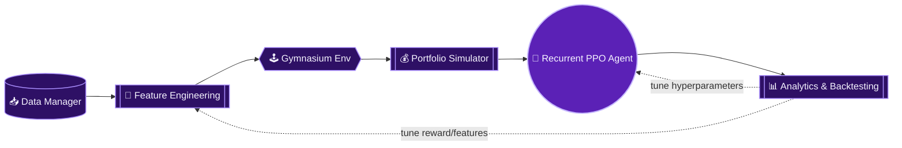

<div align="center">


<br>

[](https://www.python.org/)
[](https://github.com/Stable-Baselines-Team/stable-baselines3-contrib)
[](https://gymnasium.farama.org/)
[](#license)

<a href="https://github.com/darkisthenight07/warlock/stargazers"></a>
<a href="https://github.com/darkisthenight07/warlock/commits/main"></a>


</div>

<br>

<table align="center" width="100%">
<tr><td>

**Warlock** is a modular Reinforcement Learning framework for developing and evaluating cryptocurrency trading agents. It provides an end-to-end research pipeline — historical market data ingestion, feature engineering, a realistic portfolio simulator, and a custom Gymnasium environment — purpose-built for training and stress-testing sequence-aware RL policies such as **Recurrent PPO with an LSTM** backbone. Every stage is config-driven, meaning the whole experiment surface can be reshaped from a single YAML file without touching core code.

</td></tr>
</table>

<br>

<div align="center">

### 📚 Table of Contents

[Backtest Snapshot](#-latest-backtest-snapshot) • [Key Features](#-key-features) • [Architecture](#-architecture-overview) • [Repository Structure](#-repository-structure) • [Pipeline](#-the-pipeline) • [Core Modules](#-core-modules) • [Reward Design](#-reward-design) • [Configuration](#-configuration) • [Getting Started](#-getting-started) • [Tech Stack](#-tech-stack) • [Roadmap](#-roadmap) • [Contributing](#-contributing) • [License](#license)

</div>

<br>

---

## 📊 Latest Backtest Snapshot

<div align="center">

<br>

<table>
<thead>
<tr>
<th align="left">Metric</th>
<th align="center">Weakest Checkpoint</th>
<th align="center"></th>
<th align="center">Best Checkpoint <code>(50k steps)</code></th>
</tr>
</thead>
<tbody>
<tr>
<td align="left"><b>Sharpe Ratio</b></td>
<td align="center"><code>-8.18</code></td>
<td align="center">→</td>
<td align="center">🟢 <b>0.4033</b></td>
</tr>
<tr>
<td align="left"><b>Total Return</b></td>
<td align="center"><code>-29.81%</code></td>
<td align="center">→</td>
<td align="center">🟢 <b>+3.08%</b></td>
</tr>
<tr>
<td align="left"><b>Profit Factor</b></td>
<td align="center"><code>0.517</code></td>
<td align="center">→</td>
<td align="center">🟢 <b>1.2639</b></td>
</tr>
<tr>
<td align="left"><b>Expectancy</b></td>
<td align="center"><code>-4.93</code></td>
<td align="center">→</td>
<td align="center">🟢 <b>+1.97</b></td>
</tr>
</tbody>
</table>

</div>

<br>

<div align="center">

#### Full Metric Breakdown

<table>
<thead>
<tr><th align="left">Category</th><th align="left">Metric</th><th align="center">Value</th></tr>
</thead>
<tbody>
<tr><td rowspan="4" align="left"><b>Returns</b></td><td>Total Return</td><td align="center">🟢 +3.08%</td></tr>
<tr><td>Annualized Return / CAGR</td><td align="center">🟢 +4.42%</td></tr>
<tr><td>Annualized Volatility</td><td align="center">12.74%</td></tr>
<tr><td>Final Capital</td><td align="center">$10,307.61</td></tr>
<tr><td rowspan="4" align="left"><b>Risk-Adjusted</b></td><td>Sharpe Ratio</td><td align="center">🟢 0.4033</td></tr>
<tr><td>Sortino Ratio</td><td align="center">0.0061</td></tr>
<tr><td>Calmar Ratio</td><td align="center">🟢 0.5504</td></tr>
<tr><td>Peak Capital</td><td align="center">$10,625.75</td></tr>
<tr><td rowspan="4" align="left"><b>Drawdown</b></td><td>Max Drawdown</td><td align="center">🟢 8.03%</td></tr>
<tr><td>Average Drawdown</td><td align="center">2.54%</td></tr>
<tr><td>Longest Drawdown (steps)</td><td align="center">3,205</td></tr>
<tr><td>Minimum Capital</td><td align="center">$9,316.84</td></tr>
<tr><td rowspan="5" align="left"><b>Trade Quality</b></td><td>Total Trades</td><td align="center">1,264</td></tr>
<tr><td>Closing Trades</td><td align="center">533</td></tr>
<tr><td>Win Rate</td><td align="center">46.72%</td></tr>
<tr><td>Profit Factor</td><td align="center">🟢 1.2639</td></tr>
<tr><td>Expectancy</td><td align="center">🟢 +1.97</td></tr>
</tbody>
</table>

</div>


<br>

---

## ✨ Key Features

<table>
<tr>
<td width="50%" valign="top">

**Data & Features**
- 🔄 Modular data pipeline — Binance via `ccxt`, gap-filling, anomaly detection
- 🧬 Feature engineering across 5 indicator families
- 📉 Auto-generated diagnostic plots (correlation, Sharpe, distributions)

</td>
<td width="50%" valign="top">

**Environment & Execution**
- 🕹️ Custom Gymnasium env for sequence-aware policies
- 💰 Realistic spot simulator — fees, slippage, min notionals
- 🛡️ ATR-based SL/TP, dynamic sizing, drawdown protection

</td>
</tr>
<tr>
<td width="50%" valign="top">

**Agent & Training**
- 🧠 Recurrent PPO (LSTM policy) via `sb3-contrib`
- 🎯 Optuna-based hyperparameter optimization
- 🌱 Multi-seed runs for robustness validation

</td>
<td width="50%" valign="top">

**Reward & Analytics**
- 📈 Rolling Sharpe-ratio objective with return blending
- ⚖️ Drawdown and overtrading penalties
- 📊 VectorBT-powered metrics, leaderboards, reporting

</td>
</tr>
</table>

<br>

---

## 🏗️ Architecture Overview



<br>

---

## 🗂️ Repository Structure

```text
warlock/
├── main.py                     # Runs the data + feature pipeline end-to-end
├── config.yaml                 # Single source of truth for the entire system
├── requirements.txt
│
├── src/
│   ├── data_manager/            → downloading, cleaning, anomaly detection
│   ├── features/                → indicator pipeline + feature plots
│   ├── env/                     → Gymnasium env, reward engineering
│   ├── portfolio/                → order execution, sizing, trade/equity history
│   ├── agent/                    → PPO trainer, HPO, multi-seed, evaluation
│   ├── analytics/                → checkpoint evaluation, leaderboards, reports
│   ├── benchmark/                → buy & hold / random-agent baselines
│   ├── utils/                    → config loader, seeding, path helpers
│   └── tests/                    → env, portfolio & reward verification suite
│
├── experiments/                 → per-run configs, checkpoints, logs
├── graphs/features/              → auto-generated feature diagnostic plots
└── notebooks/                    → exploratory analysis
```

<br>

---

## 🔁 The Pipeline

<div align="center">

| Stage | Module | What Happens |
|:--|:--|:--|
| **1 · Ingest** | `data_manager` | Historical OHLCV pulled from Binance, cleaned, gap-filled, flagged for wick anomalies |
| **2 · Engineer** | `features` | Price, candle, momentum, volatility & volume features computed + plotted |
| **3 · Simulate** | `env` + `portfolio` | Custom Gym env wraps a realistic execution simulator (fees, slippage, ATR SL/TP) |
| **4 · Train** | `agent` | Recurrent PPO (LSTM) trained against the risk-aware reward signal |
| **5 · Evaluate** | `analytics` | Checkpoints scored, ranked on a leaderboard, and reported via VectorBT metrics |
| **6 · Iterate** | `agent.hpo` | Optuna sweeps hyperparameters and reward weights against evaluation results |

</div>

<br>

---

## 📦 Core Modules

<details>
<summary><b>1 · Data Management</b> — <code>src/data_manager/</code></summary>
<br>

- **Downloader & Cleaner** — automates historical OHLCV downloads from exchanges (e.g. Binance), with duplicate removal and missing-candle handling.
- **Anomaly Detection** — flags structural anomalies such as extreme wick deviations using rolling windows and configurable wick multipliers.

</details>

<details>
<summary><b>2 · Feature Engineering Suite</b> — <code>src/features/</code></summary>
<br>

- Builds distinct features across **Price Action, Candlestick, Momentum, Volatility, and Volume** categories.
- Automated feature profiling generates diagnostic plots in `graphs/features/` — correlation profiles, rolling Sharpe ratios, trend strength, and distribution histograms.

</details>

<details>
<summary><b>3 · Custom Gymnasium Environment</b> — <code>src/env/</code></summary>
<br>

- `gym_bitcoin.py` implements a custom Gymnasium interface that streams price tensors and historical lookback windows into standard RL networks — including recurrent (LSTM) policies.

</details>

<details>
<summary><b>4 · Advanced Portfolio Simulator</b> — <code>src/portfolio/</code></summary>
<br>

- Emulates realistic spot trading: configurable maker/taker fees, slippage models, minimum trade notional limits, and rebalancing.
- Includes ATR-based Stop Loss / Take Profit, dynamic position sizing, and portfolio-level drawdown protection.
- Maintains a full trade and equity history per episode for post-hoc analysis.

</details>

<details>
<summary><b>5 · Reward Engineering</b> — <code>src/env/rewards.py</code></summary>
<br>

- Risk-aware reward combining immediate portfolio returns with a **rolling, aggregated Sharpe-ratio objective**.
- Returns are aggregated over a short window before entering the Sharpe buffer, so the ratio reflects sustained performance rather than single-tick noise.
- Additional drawdown and overtrading penalties discourage churn and excessive risk-taking in favor of stable, risk-adjusted behavior.

</details>

<details>
<summary><b>6 · Agent & Experimentation</b> — <code>src/agent/</code></summary>
<br>

- `trainer.py` — orchestrates Recurrent PPO training (`sb3-contrib`), environment vectorization, and callbacks.
- `hpo.py` — Optuna-based hyperparameter optimization.
- `multi_seed.py` — multi-seed runs for robustness checks.
- `evaluate.py` / `quick_eval.py` — checkpoint evaluation utilities.
- `experiment.py` — experiment tracking and run-directory management (see `experiments/`).

</details>

<details>
<summary><b>7 · Analytics & Reporting</b> — <code>src/analytics/</code></summary>
<br>

- Checkpoint evaluation, leaderboard generation, and cross-run comparison.
- `vbt_metrics.py` — VectorBT-powered performance metrics (Sharpe, returns, profit factor, expectancy).
- Report and plot generation for backtest results.

</details>

<br>

---

## 🧮 Reward Design

The reward function blends four signals into a single risk-adjusted scalar:

$$R_t = w_r \cdot r_t \;+\; w_s \cdot \text{Sharpe}_t \;-\; \lambda_{dd} \cdot \text{Drawdown}_t \;-\; \lambda_{ot} \cdot \text{Overtrade}_t$$

<div align="center">

| Term | Purpose |
|:--|:--|
| `step_return_weight · r_t` | Rewards immediate, realized portfolio return |
| `sharpe_weight · Sharpe_t` | Rewards *consistency* of returns over a rolling, aggregated window |
| `drawdown_penalty_scale` | Penalizes portfolio-level drawdown beyond safe thresholds |
| `overtrade_penalty_scale` | Penalizes excessive turnover / churn |

</div>

All four weights, plus the Sharpe window length and aggregation step size, are exposed directly in `config.yaml` under `reward:` — enabling systematic HPO sweeps over reward shape itself, not just network hyperparameters.

<br>

---

## ⚙️ Configuration

Every module is fully decentralized and governed by a single `config.yaml`. This lets you instantly:

- Swap exchange, symbol, and timeframe settings
- Toggle active technical indicators
- Tune trading fees, slippage, and leverage (spot & short)
- Configure lookback/observation windows
- Adjust risk parameters (ATR-based SL/TP, max drawdown)
- Reshape the reward function without touching core code

<details>
<summary><b>Example config snippet</b></summary>

```yaml
env:
  action_scale: 0.5
  window_len: 48
  max_trade_step: 0.2
  transaction_cost_rate: 0.0005
  max_drawdown: 0.3
  initial_capital: 10000.0

risk:
  stop_loss_atr_multiple: 1.5
  take_profit_atr_multiple: 3.0
  target_atr_pct: 1.0
```

</details>

<br>

---

## 🚀 Getting Started

### Prerequisites
- Python 3.8+
- `TA-Lib` C-library dependencies (required for technical indicators)

### 1 · Installation

```bash
# Clone the repository
git clone https://github.com/darkisthenight07/warlock
cd warlock

# Create and activate a virtual environment
python -m venv venv
venv\Scripts\activate

# Install dependencies
pip install -r requirements.txt
```

### 2 · Run the Data & Feature Pipeline

Downloads data, builds clean feature matrices, and generates diagnostic charts in `graphs/`:

```bash
python main.py
```

### 3 · Train the Agent

```bash
python -m src.agent.train
```

### 4 · Component Verification Tests

```bash
# Verify reward scaling, buffer mechanics, and penalties
python -m src.tests.test_rewards

# Verify trade execution, fee charges, slippage, and liquidations
python -m src.tests.test_portfolio

# Verify Gymnasium state handling, lookback observations, step updates, and resets
python -m src.tests.test_env
```

<br>

---

## 🧠 Tech Stack

<div align="center">


</div>

<br>

---

## 🗺️ Roadmap

- [ ] Expand to multi-asset portfolios (`ETH/USDT` and beyond)
- [ ] Live / paper-trading execution bridge
- [ ] Extended HPO sweeps across reward-shaping variants
- [ ] Model export & inference API for trained checkpoints
- [ ] Walk-forward validation harness for out-of-sample robustness

<br>

---


## License

Distributed under the **MIT License**.

<br>

---

<div align="center">

*"An edge isn't found — it's engineered, back-tested, and earned one Sharpe ratio at a time."*

<br>


</div>
